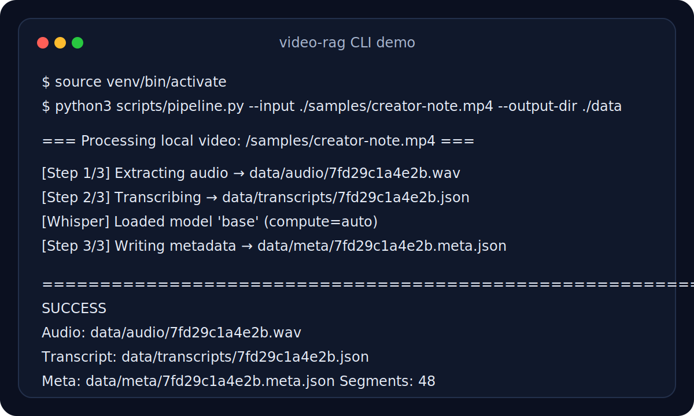

# Tiktok-rag

Turn short videos into timestamped, searchable knowledge for your LLM.

> Local-video-first MVP for developers building short-video RAG workflows.

[中文说明](docs/README.zh-CN.md) · [Sample output](docs/public-sample-output.md) · [Discussion seed](docs/discussions/roadmap-feedback-seed.md) · [Discussions](https://github.com/Jia-Ethan/Tiktok-rag/discussions)



## What works today

- Convert a local video file (`.mp4`, `.mov`, `.mkv`) into a 16kHz mono WAV file.
- Transcribe speech with `faster-whisper`.
- Export timestamped transcript JSON plus metadata JSON.
- Keep the pipeline local-first and easy to inspect.

## Why this is useful for LLM workflows

Short videos contain a lot of useful ideas, but most of them are trapped inside audio. This project turns those videos into structured text artifacts that are ready for the next RAG steps: chunking, indexing, retrieval, summarization, and prompt context building.

The current release is intentionally narrow: it solves the first reliable step well, instead of pretending the whole short-video ingestion stack is already done.

## Demo output

The current public demo uses a local video file as input and produces:

- `data/audio/<job_id>.wav`
- `data/transcripts/<job_id>.json`
- `data/meta/<job_id>.meta.json`

See the full public sample here:

- [docs/public-sample-output.md](docs/public-sample-output.md)

## Quickstart

### Requirements

- Python 3.9+
- `ffmpeg`

Install `ffmpeg`:

```bash
# macOS
brew install ffmpeg

# Ubuntu / Debian
sudo apt install ffmpeg
```

### Setup

```bash
git clone https://github.com/Jia-Ethan/Tiktok-rag.git
cd Tiktok-rag
python3 -m venv venv
source venv/bin/activate
pip install -r requirements.txt
```

### Run

```bash
python3 scripts/pipeline.py \
  --input /path/to/video.mp4 \
  --output-dir ./data
```

Optional model selection:

```bash
python3 scripts/pipeline.py \
  --input /path/to/video.mp4 \
  --output-dir ./data \
  --model small
```

## Current limitations

- Stable public support is for **local video files only**.
- Douyin/TikTok URL ingestion is an **experimental placeholder**, not a reliable public feature.
- No chunking, vector store, retrieval UI, or Web app yet.
- No batch ingestion yet.

## Roadmap

### Next up

1. Make URL ingestion boundaries explicit and better structured.
2. Add chunk-ready transcript output for downstream retrieval.
3. Add a minimal retrieval layer so the “RAG” part becomes directly demoable.

### Not in this release

- Cookie-based login automation
- Browser automation for downloads
- Chroma integration
- Web UI

## Feedback and discussions

If this project is interesting to you, the most helpful feedback right now is:

- What short-video knowledge workflow are you trying to build?
- Would local-file-first still be useful for your use case?
- What should come first after transcription: chunking, retrieval, or URL ingestion?

Use:

- [GitHub Discussions](https://github.com/Jia-Ethan/Tiktok-rag/discussions) for roadmap and product feedback
- GitHub Issues for bugs or concrete feature requests

## Project structure

```text
Tiktok-rag/
├── app/                     # Reserved for future UI work
├── docs/
│   ├── assets/
│   ├── discussions/
│   ├── public-sample-output.md
│   └── README.zh-CN.md
├── scripts/
│   └── pipeline.py
├── data/                    # Runtime output (gitignored)
│   ├── audio/
│   ├── meta/
│   ├── raw/
│   └── transcripts/
├── .github/
│   └── ISSUE_TEMPLATE/
├── CONTRIBUTING.md
├── LICENSE
└── requirements.txt
```

## License

[MIT](LICENSE)
