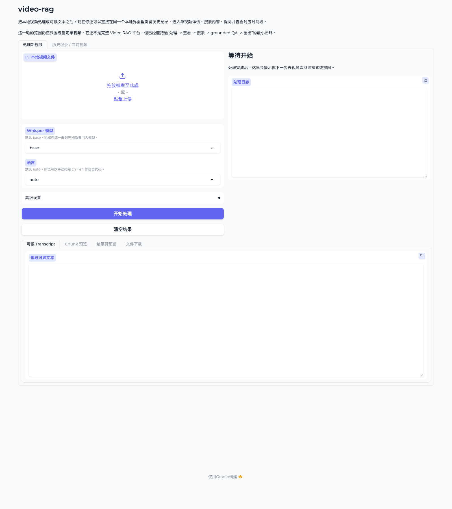

# video-rag

**Turn one local video into readable text, searchable chunks, grounded answers, and reusable artifacts on your own machine.**

`video-rag` 现在已经不只是“本地视频转文字工具”。

当前版本可以在同一个本地 UI 里完成这一条最小闭环：

- 选择一个本地视频并处理
- 查看历史纪录
- 进入单视频详情页
- 搜索当前视频内容
- 基于当前视频内容提问并得到带时间段引用的答案
- 匯出搜索结果、问答结果或单视频摘要

它仍然**不是**完整 Video RAG 平台。当前范围只围绕**本地单视频**，不包含 URL、线上部署、多用户、多视频知识库或向量检索。



## 它现在能帮你做什么

你把一个已经下载到本地的视频交给 `video-rag` 后，会得到两层结果：

- 普通用户可直接消费的结果：
  - 可读 transcript
  - `preview.md`
  - 当前视频搜索
  - grounded QA
  - 可直接打开的匯出文件
- 开发者可继续接入的结构层：
  - `transcripts.json`
  - `chunks.json`
  - `meta.json`
  - `manifest.json`

如果你第一次试用，不需要先打开 JSON。先看 `preview.md`、`text.txt`，再去“历史纪录 / 当前视频”里做搜索和提问。

## 适合谁

- 想把单个本地视频转成可读结果，再继续搜索或提问的人
- 想做课程、访谈、分享、短视频内容整理的人
- 想先在本地跑通“处理 -> 搜索 -> grounded QA”闭环的人
- 本地优先，不想一开始就搭建数据库、向量库或线上服务的个人用户与独立开发者

## 不适合谁

- 想直接贴 URL 完成全流程的人
- 期待它现在已经是多视频知识库或完整 Video RAG 平台的人
- 需要线上部署、多人协作、多视频统一检索的人
- 需要 semantic chunking 重做或大规模 benchmark 的人

## 第一次使用路径

1. 准备一个已经下载到本地的视频文件
2. 安装 `ffmpeg`
3. 创建虚拟环境并安装依赖
4. 运行本地 UI：`python3 app/gradio_app.py`
5. 在浏览器里处理一个视频
6. 处理完成后，切到“历史纪录 / 当前视频”
7. 进入该视频详情页，继续搜索或提问

更细的普通用户说明见：

- [docs/beginner-quickstart.md](docs/beginner-quickstart.md)

## 处理完一个视频后，你会得到什么

### 最适合普通用户先打开的文件

- `data/preview/<job_id>.md`
  这是第一次最适合打开看的文件。它会告诉你这次处理的标题、语言、时长、chunk 预览，以及每个输出文件该怎么用。
- `data/text/<job_id>.txt`
  这是最适合直接阅读、复制、发到笔记软件或发给别人的纯文本版本。

### 最适合在 UI 里继续做的事

- 在“历史纪录 / 当前视频”中打开当前视频详情页
- 搜索关键词并定位到 chunk 与时间段
- 基于当前视频内容提问
- 查看引用对应的时间段和 chunk 内容
- 匯出搜索结果、问答结果或单视频摘要

### 其他结构化输出文件

- `data/transcripts/<job_id>.json`
  原始时间戳 transcript，适合开发者或后续脚本处理。
- `data/chunks/<job_id>.chunks.json`
  当前视频搜索与 grounded QA 使用的 chunk-ready artifact，也是后续检索层的基础。
- `data/meta/<job_id>.meta.json`
  处理元数据，负责把输入视频和输出文件关系串起来。
- `data/manifests/<job_id>.manifest.json`
  一次运行的摘要文件，也是首页“历史纪录 / 视频库”的主资料源。

## 快速开始

### 1. 准备环境

- Python 3.9+
- `ffmpeg`

安装 `ffmpeg`：

```bash
# macOS
brew install ffmpeg

# Ubuntu / Debian
sudo apt install ffmpeg
```

### 2. 安装依赖

```bash
git clone https://github.com/Jia-Ethan/video-rag.git
cd video-rag
python3 -m venv venv
source venv/bin/activate
python -m pip install -r requirements.txt
```

### 3. 启动本地 UI

```bash
python3 app/gradio_app.py
```

默认本地地址通常是：

```text
http://127.0.0.1:7860
```

如果你的环境里 `127.0.0.1` 访问有问题，可以这样启动：

```bash
VIDEO_RAG_HOST=0.0.0.0 VIDEO_RAG_PORT=7860 python3 app/gradio_app.py
```

### 4. 如果你更习惯命令行

```bash
python3 scripts/pipeline.py \
  --input /path/to/local-video.mp4 \
  --output-dir ./data \
  --language auto
```

## 本地搜索与问答怎么工作

- 搜索只针对**当前选中的一个视频**
- 搜索范围只限当前视频的 `chunks.json`
- 问答也只基于当前视频的 chunks，不做开放聊天
- 答案必须带引用；引用至少对应 chunk 编号和时间段
- 如果当前视频里没有足够依据，系统会明确说依据不足，不会硬答

### QA 配置

当前 grounded QA 使用 **OpenAI 兼容 API**。你可以用环境变量预设，也可以在 UI 的 QA 设置里临时填写：

- `VIDEO_RAG_QA_BASE_URL`
- `VIDEO_RAG_QA_MODEL`
- `VIDEO_RAG_QA_API_KEY`

API key 只保存在当前 UI 会话里，不写入磁盘。

## 它现在是什么，不是什么

它现在是：

- 本地单视频处理工具
- 本地单视频搜索与 grounded QA 闭环
- 可继续输出结构化 artifact 的基础层

它还不是：

- 完整 Video RAG 平台
- 多视频统一知识库
- URL 下载器
- 向量库 / 线上检索 / Web 部署方案

下一步最合理的发展方向仍然是：

- 在现有单视频 grounded QA 验证成立后，再考虑最小 multi-video retrieval-ready loop

## 已知限制

- 只支持本地视频文件，不支持 URL
- 搜索仍然是关键词匹配，不是 embedding / semantic retrieval
- grounded QA 只针对当前单视频，不支持跨视频问答
- 当前 chunking 仍然是结构型、保守型策略，不是 semantic chunking
- 长视频、多语言、强噪音、多说话人场景还没有系统 benchmark

## 文档

### 普通用户文档

- [docs/beginner-quickstart.md](docs/beginner-quickstart.md)

### Developer docs

- [docs/public-sample-output.md](docs/public-sample-output.md)
- [docs/chunk-artifact-spec.md](docs/chunk-artifact-spec.md)
- [docs/local-search-qa-architecture.md](docs/local-search-qa-architecture.md)
- [docs/feedback-guide.md](docs/feedback-guide.md)

## 项目结构

```text
video-rag/
├── app/
│   └── gradio_app.py
├── docs/
│   ├── assets/
│   ├── beginner-quickstart.md
│   ├── chunk-artifact-spec.md
│   ├── local-search-qa-architecture.md
│   ├── feedback-guide.md
│   └── public-sample-output.md
├── scripts/
│   └── pipeline.py
├── data/
│   ├── audio/
│   ├── chunks/
│   ├── exports/
│   ├── manifests/
│   ├── meta/
│   ├── preview/
│   ├── text/
│   └── transcripts/
└── requirements.txt
```

## 反馈

- 新手体验反馈：GitHub Issues 里的 beginner / UX 模板
- 路线和工作流反馈：[GitHub Discussions](https://github.com/Jia-Ethan/video-rag/discussions)
- 直接联系：`ethan_pier@icloud.com`

## License

[MIT](LICENSE)
